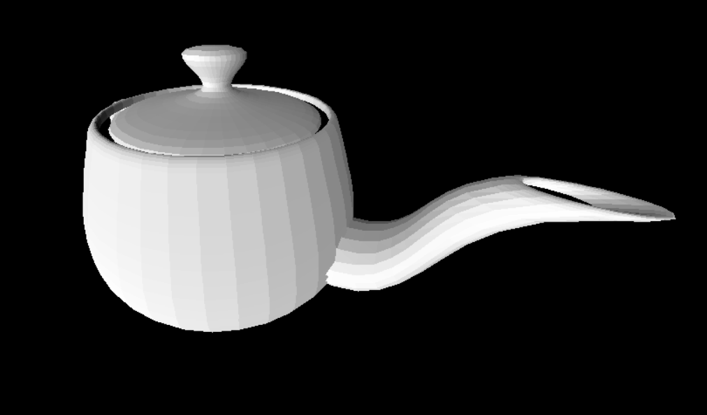
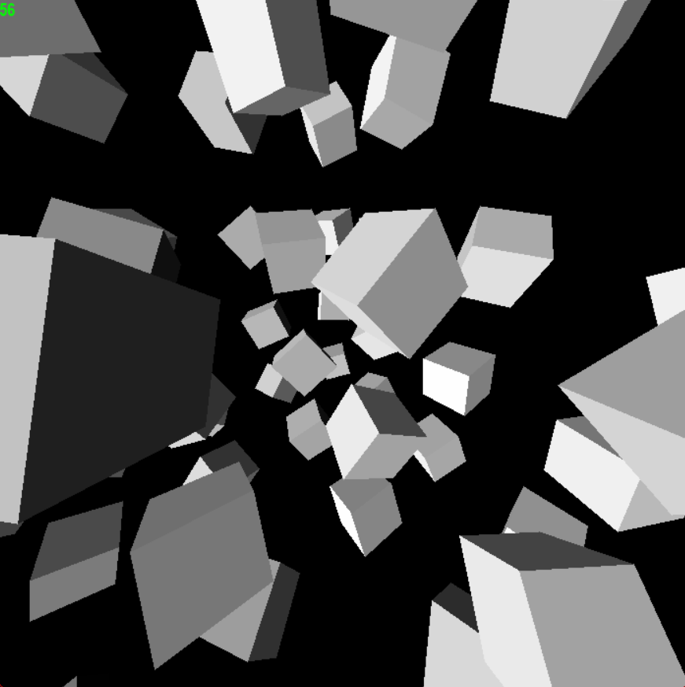

# Rasterizer

Software rasterizer implemented in python using pygame to render 3D objects with keyboard and mouse controlled camera.

Objects defined as vertices and triangles, explicitly or via .obj files, are transformed from model space to world space, to view space, projected onto clip space and scaled to screen space where there are draw in order of depth, following the painters algorithm. Bounding spheres are used to efficiently ignore objects that are out of view, and backface culling uses normals to ignore triangles facing away from the camera.

As an example the Utah teapot is shown, with simple directional lighting:

Stable performance is shown for a grid of randomly oriented cubes:

